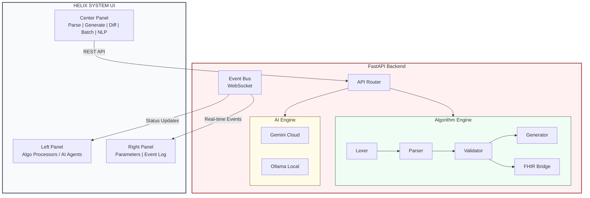
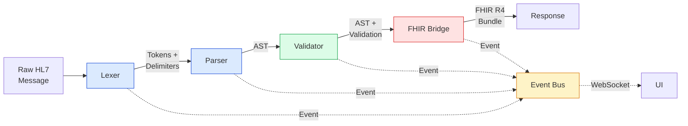
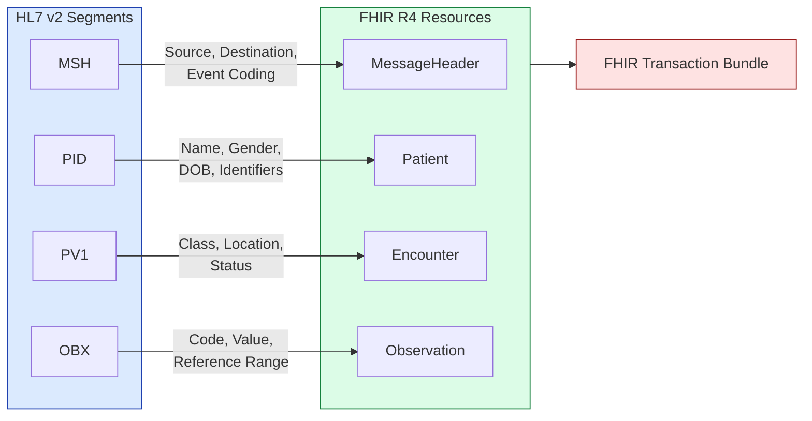
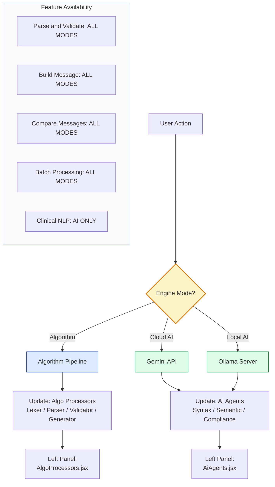

<p align="center">
  
  
  
  
  
</p>

# HELIX SYSTEM — Enterprise HL7 Nexus

> **Enterprise HL7 v2.x Orchestration Platform powered by the Nexus-Hybrid Core**

A production-grade, full-stack platform for parsing, validating, generating, and converting HL7 v2.x healthcare messages. The system features a **dual-engine architecture** — a deterministic Algorithm pipeline and an AI-powered inference engine — wrapped in a high-density mission-control UI.

---

## 📋 Table of Contents

- [Overview](#overview)
- [Key Features](#key-features)
- [Architecture](#architecture)
- [Tech Stack](#tech-stack)
- [Getting Started](#getting-started)
- [Configuration](#configuration)
- [Feature Guide](#feature-guide)
- [API Reference](#api-reference)
- [Project Structure](#project-structure)
- [Engine Modes](#engine-modes)
- [HL7 Validation Rules](#hl7-validation-rules)
- [FHIR R4 Conversion](#fhir-r4-conversion)
- [Contributing](#contributing)
- [License](#license)

---

## Overview

The **Helix System** is a web-based HL7 v2.x message processing platform designed for healthcare integration engineers, hospital IT teams, and interoperability professionals. It provides:

- **Real-time parsing** of HL7 v2 messages into a structured Abstract Syntax Tree (AST)
- **Conformance validation** against HL7 v2.5.1 specifications with 30+ rule categories
- **FHIR R4 conversion** — automated mapping from HL7 v2 segments to FHIR resources
- **Template-based message generation** with dynamic field mapping
- **AI-powered natural language to HL7** conversion using Gemini or local Ollama models
- **Segment-aware diff engine** for comparing HL7 messages at the field level
- **Batch processing** with CSV export for bulk validation workflows

---

## Key Features

| Feature | Algorithm Engine | AI Engine |
|---------|:---------------:|:---------:|
| Parse & Validate | ✅ Full pipeline with observability | ✅ Algorithm safety pass + AI review |
| Build Message | ✅ Template-based generator | ✅ AI inference from JSON |
| Compare Messages | ✅ Segment-aware diff | ✅ Segment-aware diff |
| Batch Processing | ✅ Sequential with progress | ✅ Sequential with AI review |
| Clinical NLP | ❌ | ✅ Natural language → HL7 |
| FHIR R4 Export | ✅ Automated conversion | ✅ Automated conversion + AI mapping review |

---

## Architecture

### System Overview



### Algorithm Processing Pipeline



### FHIR R4 Conversion Map



---

## Tech Stack

### Backend
| Technology | Purpose |
|-----------|---------|
| **Python 3.10+** | Runtime |
| **FastAPI** | REST API + WebSocket server |
| **Pydantic** | Request validation & serialization |
| **httpx** | Async HTTP client for external APIs |
| **Gemini REST API** | Direct Gemini Cloud AI integration |
| **uvicorn** | ASGI production server |

### Frontend
| Technology | Purpose |
|-----------|---------|
| **React 19** | UI framework |
| **Vite** | Build tool & dev server |
| **Zustand** | Lightweight state management |
| **TailwindCSS 4** | Utility-first styling |
| **Axios** | HTTP client |
| **Lucide React** | Icon library |
| **Framer Motion** | Animations |

---

## Getting Started

### Platform Compatibility

| Platform | Status | Notes |
|----------|:------:|-------|
| **macOS** (Intel & Apple Silicon) | ✅ Fully supported | Primary development platform |
| **Linux** (Ubuntu, Debian, Fedora, Arch) | ✅ Fully supported | All major distros |
| **Windows 10/11** (PowerShell) | ✅ Fully supported | Use PowerShell or CMD |
| **WSL / WSL2** (Ubuntu) | ✅ Fully supported | Recommended for Windows devs |
| **Docker** | ✅ Compatible | No native containers, no OS dependencies |

> **No native/compiled dependencies.** The entire stack is pure Python + JavaScript — no C extensions, no OS bindings, no platform-specific code. If Python 3.10+ and Node.js 18+ run on your system, Helix will too.

### Prerequisites

- **Node.js** ≥ 18.x — [Download](https://nodejs.org/)
- **Python** ≥ 3.10 — [Download](https://www.python.org/downloads/)
- **pip** (included with Python)
- **npm** (included with Node.js)
- **Git** — [Download](https://git-scm.com/)

### 1. Clone the Repository

```bash
git clone https://github.com/hardikrawat/hl7-nexus.git
cd hl7-nexus
```

### 2. Backend Setup

You'll need **two terminal windows** — one for the backend, one for the frontend.

<details>
<summary><b>🍎 macOS / 🐧 Linux / WSL</b></summary>

```bash
# Navigate to backend
cd backend

# Create and activate virtual environment
python3 -m venv venv
source venv/bin/activate

# Install dependencies
pip install -r requirements.txt

# Start the server
uvicorn main:app --reload --host 0.0.0.0 --port 8000
```

</details>

<details>
<summary><b>🪟 Windows (PowerShell)</b></summary>

```powershell
# Navigate to backend
cd backend

# Create and activate virtual environment
python -m venv venv
.\venv\Scripts\Activate.ps1

# If you get an execution policy error, run this first:
# Set-ExecutionPolicy -ExecutionPolicy RemoteSigned -Scope CurrentUser

# Install dependencies
pip install -r requirements.txt

# Start the server
uvicorn main:app --reload --host 0.0.0.0 --port 8000
```

</details>

<details>
<summary><b>🪟 Windows (CMD)</b></summary>

```cmd
REM Navigate to backend
cd backend

REM Create and activate virtual environment
python -m venv venv
venv\Scripts\activate.bat

REM Install dependencies
pip install -r requirements.txt

REM Start the server
uvicorn main:app --reload --host 0.0.0.0 --port 8000
```

</details>

The API will be available at `http://localhost:8000`. Verify with:
```bash
# macOS / Linux / WSL
curl http://localhost:8000/api/v1/health

# Windows PowerShell
Invoke-RestMethod http://localhost:8000/api/v1/health

# Expected output: {"status":"online"}
```

### 3. Frontend Setup

Open a **second terminal** (keep the backend running):

```bash
# Navigate to frontend (from project root)
cd frontend

# Install dependencies
npm install

# Start the dev server
npm run dev
```

The UI will be available at `http://localhost:5173`.

### 4. Open the Application

Navigate to **http://localhost:5173** in your browser. Both the backend and frontend must be running simultaneously.

> **WSL Users:** If accessing from a Windows browser, use `http://localhost:5173` — WSL2 automatically forwards ports. If that doesn't work, use the WSL IP: `hostname -I` and navigate to `http://<wsl-ip>:5173`.

### 🚀 One-Command Launch (Clone → Install → Run → Open Browser)

Copy-paste **one command** right after cloning — it sets up both servers and opens the app:

<details open>
<summary><b>🍎 macOS</b></summary>

```bash
cd backend && python3 -m venv venv && source venv/bin/activate && pip install -r requirements.txt && uvicorn main:app --reload --port 8000 & sleep 2 && cd ../frontend && npm install && open http://localhost:5173 && npm run dev
```

</details>

<details>
<summary><b>🐧 Linux (Ubuntu / Debian / Fedora / Arch)</b></summary>

```bash
cd backend && python3 -m venv venv && source venv/bin/activate && pip install -r requirements.txt && uvicorn main:app --reload --port 8000 & sleep 2 && cd ../frontend && npm install && xdg-open http://localhost:5173 && npm run dev
```

</details>

<details>
<summary><b>🐧 WSL (Ubuntu on Windows)</b></summary>

```bash
cd backend && python3 -m venv venv && source venv/bin/activate && pip install -r requirements.txt && uvicorn main:app --reload --port 8000 & sleep 2 && cd ../frontend && npm install && explorer.exe "http://localhost:5173" && npm run dev
```

> Uses `explorer.exe` to open your default Windows browser from inside WSL.

</details>

<details>
<summary><b>🪟 Windows (PowerShell)</b></summary>

```powershell
cd backend; python -m venv venv; .\venv\Scripts\Activate.ps1; pip install -r requirements.txt; Start-Process -NoNewWindow uvicorn -ArgumentList "main:app","--reload","--port","8000"; cd ..\frontend; npm install; Start-Process "http://localhost:5173"; npm run dev
```

</details>

<details>
<summary><b>🪟 Windows (CMD)</b></summary>

```cmd
cd backend && python -m venv venv && venv\Scripts\activate.bat && pip install -r requirements.txt && start /B uvicorn main:app --reload --port 8000 && cd ..\frontend && npm install && start http://localhost:5173 && npm run dev
```

</details>

> **What this does:** Creates a Python venv → installs backend deps → starts the API server in background → installs frontend deps → opens `http://localhost:5173` in your default browser → starts the dev server.

### Two-Terminal Setup (if you prefer)

```bash
# Terminal 1 — Backend
cd backend && python3 -m venv venv && source venv/bin/activate && pip install -r requirements.txt && uvicorn main:app --reload --port 8000

# Terminal 2 — Frontend
cd frontend && npm install && npm run dev
```

### Troubleshooting

| Issue | Solution |
|-------|----------|
| `python3: command not found` (Windows) | Use `python` instead of `python3` |
| PowerShell execution policy error | Run `Set-ExecutionPolicy RemoteSigned -Scope CurrentUser` |
| `EACCES` permission error (npm) | Don't use `sudo npm`. Fix npm permissions: [guide](https://docs.npmjs.com/resolving-eacces-permissions-errors-when-installing-packages-globally) |
| WSL can't connect to localhost | Check WSL version: `wsl --list --verbose`. Use WSL2 for best port forwarding |
| Port 8000/5173 already in use | Kill the process: `lsof -ti:8000 \| xargs kill` (macOS/Linux) or change port in commands |
| `ModuleNotFoundError` in Python | Ensure venv is activated (you should see `(venv)` in your prompt) |

---

## Configuration

### System Configuration Modal

Click the **⚙️ Settings** icon in the header to access runtime configuration:

| Setting | Description | Default |
|---------|-------------|---------|
| **Cloud Provider** | Direct Gemini API or OpenAI-compatible Gateway / Proxy | `Direct Gemini API` |
| **Gemini API Key** | Google Gemini API key for Cloud AI mode | (empty) |
| **Gateway URL / API Key** | Gateway endpoint and bearer token for routed models | (empty) |
| **Active Model** | Selected cloud model for inference | `gemini-2.5-flash-lite` |
| **Ollama URL** | Local Ollama server address | `http://localhost:11434` |
| **Terminology Server** | HL7 data source for validation rules | `HL7 Terminology (THO)` |
| **Workspace Layout** | UI layout mode (Classic / IDE / Unified) | `Classic` |

### Environment Variables (Optional)

Create a `.env` file in the `frontend/` directory:

```env
VITE_API_URL=http://localhost:8000
VITE_WS_URL=ws://localhost:8000
```

---

## Feature Guide

### 🔬 Parse & Validate

Paste a raw HL7 v2 message and execute the processing pipeline:

1. **Lexer** — Tokenizes the message, detects delimiters (supports `|`, `^`, `~`, `\`, `&`)
2. **Parser** — Builds an Abstract Syntax Tree with component/subcomponent decomposition
3. **Validator** — Checks against 30+ conformance rules:
   - Required segments per message type
   - Required fields per segment
   - Date/time format validation (YYYYMMDDHHMMSS)
   - HL7 Table value checks (sex, patient class, processing ID)
   - Segment cardinality and ordering
4. **FHIR Bridge** — Converts the AST to a FHIR R4 Transaction Bundle

### 🏗️ Build Message

Generate structurally correct HL7 messages from JSON patient data:

- **Algorithm Mode**: Uses template-based generation with dynamic field mapping
- **AI Mode**: Sends structured data to the AI engine for intelligent HL7 construction
- Supported templates: `ADT^A01`, `ADT^A03`, `ADT^A08`, `ORU^R01`, `ORM^O01`

### 🔄 Compare Messages

Segment-aware diff engine that:
- Matches segments by their 3-letter identifier (not by line position)
- Shows field-level changes within modified segments
- Provides summary statistics (unchanged / modified / added / removed)

### 📦 Batch Processing

Process multiple HL7 messages in sequence:
- Separate messages with blank lines
- Real-time progress bar and per-message results
- Export results as CSV with validation metrics

### 🧠 Clinical NLP (AI Only)

Enter natural language clinical descriptions and generate valid HL7 messages:
- Powered by Google Gemini (Cloud) or Ollama (Local)
- Automatic markdown cleanup of AI output

---

## API Reference

### Health Check
```
GET /api/v1/health
→ {"status": "online"}
```

### Parse & Validate
```
POST /api/v1/algo/process
Body: {"message": "MSH|^~\\&|..."}
→ {"ast": {...}, "validation": {...}, "fhir": {...}}
```

### Generate Message
```
POST /api/v1/algo/generate
Body: {"template": "ADT_A01", "data": {"patientId": "12345", ...}}
→ {"message": "MSH|^~\\&|..."}
```

### Natural Language → HL7
```
POST /api/v1/engine/nl_parse
Body: {"engine_mode": "cloud_ai", "model": "gemini-1.5-flash", "api_key": "...", "text": "..."}
→ {"hl7": "MSH|^~\\&|..."}
```

### Fetch Gemini Models
```
POST /api/v1/engine/gemini/models
Body: {"api_key": "..."}
→ {"models": [{id, name, isFree, rateLimit}, ...]}
```

### WebSocket Event Bus
```
WS /ws/eventbus
← {"type": "EventType.PROC_START", "engine": "algorithm", "detail": "...", "severity": "INFO", "timestamp": "..."}
```

---

## Project Structure

```
hl7-nexus/
├── backend/
│   ├── main.py                      # FastAPI app, CORS, WebSocket, lifespan
│   ├── requirements.txt             # Python dependencies
│   ├── engines/
│   │   ├── base.py                  # LLMProvider abstract base class
│   │   ├── gemini_ai.py             # Google Gemini Cloud AI provider
│   │   ├── local_ai.py              # Ollama local AI provider
│   │   └── algorithm/
│   │       ├── lexer.py             # HL7 tokenizer (delimiter detection, MSH handling)
│   │       ├── parser.py            # AST builder (component/subcomponent decomposition)
│   │       ├── validator.py         # Conformance engine (30+ rules, table checks)
│   │       ├── generator.py         # Template-based message generator
│   │       ├── fhir_bridge.py       # HL7 v2 → FHIR R4 conversion
│   │       └── data_fetcher.py      # HL7 terminology tables (11 tables, 18 schemas)
│   ├── routers/
│   │   ├── algorithm.py             # /api/v1/algo/* endpoints
│   │   └── engine.py                # /api/v1/engine/* endpoints
│   └── services/
│       └── event_bus.py             # WebSocket event broadcasting
│
├── frontend/
│   ├── src/
│   │   ├── App.jsx                  # Root layout with error boundary
│   │   ├── config/
│   │   │   └── api.js               # Centralized API URL configuration
│   │   ├── store/
│   │   │   └── nexusStore.js        # Zustand global state
│   │   ├── hooks/
│   │   │   └── useWebSocket.js      # WebSocket with exponential backoff reconnection
│   │   ├── components/
│   │   │   ├── layout/
│   │   │   │   ├── GlobalHeader.jsx # Engine mode toggle, session timer
│   │   │   │   ├── LeftPanel.jsx    # Pipeline monitors (algo/AI adaptive)
│   │   │   │   ├── CenterPanel.jsx  # Tab router with engine-mode awareness
│   │   │   │   ├── RightPanel.jsx   # Parameters + Event Log
│   │   │   │   └── GlobalFooter.jsx # System metrics bar
│   │   │   ├── center/
│   │   │   │   ├── ParseTab.jsx     # Parse & Validate (mode-aware)
│   │   │   │   ├── GenerateTab.jsx  # Build Message (mode-aware)
│   │   │   │   ├── DiffTab.jsx      # Segment-aware diff engine
│   │   │   │   ├── BatchTab.jsx     # Batch processing (mode-aware)
│   │   │   │   └── NlInputTab.jsx   # Clinical NLP (AI-only)
│   │   │   ├── agents/
│   │   │   │   ├── AlgoProcessors.jsx  # Algorithm pipeline cards
│   │   │   │   └── AiAgents.jsx        # AI agent monitor cards
│   │   │   └── shared/
│   │   │       ├── ConfigModal.jsx  # System configuration dialog
│   │   │       └── ErrorBoundary.jsx # Crash recovery boundary
│   │   └── index.css
│   ├── package.json
│   └── vite.config.js
│
└── README.md                        # This file
```

---

## Engine Modes

The Helix System operates in one of three engine modes, selectable from the header:

### ⬡ Algorithm Mode
- Deterministic, rule-based processing
- Full pipeline visibility: Lexer → Parser → Validator → Generator → FHIR Bridge
- Intentional processing delays for operational observability
- Left panel shows **Algorithm Processor** status cards

### ☁️ Cloud AI Mode (Direct Gemini or Gateway)
- Supports direct Gemini API keys and OpenAI-compatible Gateway / Proxy credentials
- Powers Clinical NLP, AI-assisted message generation, parse review, batch review, diff review, and FHIR mapping review
- Left panel shows **AI Agent** status cards

### ⬡ Local AI Mode (Ollama)
- Requires a local Ollama server running at the configured URL
- Same capabilities as Cloud AI but runs entirely on-premises
- No data leaves your network

### Engine Mode Routing



---

## HL7 Validation Rules

The validator checks against these categories:

| Category | Rule ID Pattern | Description |
|----------|----------------|-------------|
| **Structure** | `STRUCT-*` | Required segments per message type (ADT^A01, ORU^R01, etc.) |
| **Fields** | `FIELD-*` | Required fields per segment (MSH-9, MSH-10, PID-3, PID-5, etc.) |
| **Date/Time** | `DT-*` | Timestamp format validation (YYYYMMDDHHMMSS) |
| **Tables** | `TABLE-*` | Value validation against HL7 Tables (0001 Sex, 0004 Patient Class, 0103 Processing ID) |
| **Ordering** | `ORDER-*` | Segment ordering (MSH must be first) |
| **Cardinality** | `CARD-*` | Duplicate detection for singleton segments |
| **Version** | `VER-*` | HL7 version ID verification |

### Embedded HL7 Tables

11 standard tables are embedded for offline validation:

`Table 0001` (Sex) · `Table 0002` (Marital Status) · `Table 0003` (Event Type) · `Table 0004` (Patient Class) · `Table 0005` (Race) · `Table 0063` (Relationship) · `Table 0103` (Processing ID) · `Table 0104` (Version ID) · `Table 0125` (Value Type) · `Table 0203` (Identifier Type) · `Table 0396` (Coding System)

---

## FHIR R4 Conversion

The FHIR Bridge maps HL7 v2 segments to FHIR R4 resources:

| HL7 v2 Segment | FHIR R4 Resource | Key Mappings |
|---------------|------------------|--------------|
| **MSH** | `MessageHeader` | Source, destination, event coding |
| **PID** | `Patient` | Name, gender, DOB, identifiers |
| **PV1** | `Encounter` | Class, location, status |
| **OBX** | `Observation` | Code, value (NM→Quantity, ST→String), reference range |

Output is a FHIR R4 **Transaction Bundle** ready for submission to a FHIR server.

---

## Contributing

1. **Fork** the repository
2. **Create** a feature branch: `git checkout -b feature/my-feature`
3. **Commit** your changes: `git commit -m 'Add my feature'`
4. **Push** to the branch: `git push origin feature/my-feature`
5. **Open** a Pull Request

### Development Guidelines

- Backend: Follow PEP 8, use type hints, add docstrings
- Frontend: Use functional components, Zustand for state, centralized API config
- All HL7 processing logic must handle `\r`, `\n`, and `\r\n` line endings
- Engine-mode-aware components must update the correct pipeline panel (processors vs agents)

---

## License

This project is licensed under the **MIT License** — see the [LICENSE](LICENSE) file for details.

---

<p align="center">
  <sub>Built with ❤️ for the healthcare interoperability community</sub>
</p>
